# Leaderboards — precomputed snapshots (Story B2, batch path)

**Status:** Implemented (schema + types + rules)  
**Depends on:** [leaderboards-phase3-adr.md](leaderboards-phase3-adr.md) (Story A0), [leaderboards-schema-query-path.md](leaderboards-schema-query-path.md) (Story B1)

## When to use this vs query path (B1)

| Path | Use case |
|------|----------|
| **B1 — Query** | Collection-group reads on `users/*/stats/summary` (Admin / trusted API). Good for **staging**, low MAU, or **on-demand** API that runs the query per request (with strict `limit`). |
| **B2 — Precomputed (this doc)** | **Fixed top-K** documents rebuilt on a **schedule** (Cloud Scheduler + job using Admin SDK). **O(1) client read** per board; predictable cost at scale. **Preferred for production** per ADR Option A. |

You may run **both**: API falls back to query path in dev; production reads snapshots only.

## Collection layout

Single top-level collection **`leaderboards`**, subcollection **`snapshots`**, one document per **board** (v1 all-time only):

```
leaderboards/snapshots/{boardId}
```

| `boardId` | Board |
|-----------|--------|
| `global` | All-time wins across all modes (`totals.wins`) |
| `bio-ball` | `totalsByMode.bio-ball.wins` |
| `career-path` | `totalsByMode.career-path.wins` |
| `nickname-streak` | `totalsByMode.nickname-streak.wins` |

**Weekly / period:** Not used in v1. Future boards can add e.g. `leaderboards/snapshots/weekly_2026-W03` in a Phase 3.1 amendment.

```mermaid
flowchart TB
  subgraph job [Scheduled job — Admin SDK]
    Q[Query or scan source stats]
    S[Sort + take top K]
    W["set() full snapshot doc"]
  end
  subgraph fs [Firestore]
    D1["leaderboards/snapshots/global"]
    D2["leaderboards/snapshots/bio-ball"]
    D3["..."]
  end
  Q --> S --> W --> D1
  W --> D2
  W --> D3
```



## Document shape (authoritative)

Each `leaderboards/snapshots/{boardId}` document:

| Field | Type | Required | Description |
|-------|------|----------|-------------|
| `schemaVersion` | `number` | Yes | Snapshot schema version (see `LEADERBOARD_SNAPSHOT_SCHEMA_VERSION` in TS). Bump when changing shape. |
| `boardId` | `string` | Yes | Must match path segment; one of the four v1 ids. |
| `tieBreakPolicy` | `string` | Yes | Fixed literal **`score_desc_uid_asc`** (matches ADR). |
| `topK` | `number` | Yes | How many rows are stored (≤ configured max, e.g. 500). |
| `entries` | `array` | Yes | Ordered **rank 1 … N**; see [Entry object](#entry-object). |
| `generatedAt` | `Timestamp` | Yes | When the job **finished** writing this snapshot (server time). |
| `aggregateSchemaVersion` | `number` | No | Optional copy of `STATS_SCHEMA_VERSION` / `aggregateVersion` from source stats for debugging. |
| `sourceRowCount` | `number` | No | Optional: how many user stats docs were considered (for ops metrics). |

No other top-level fields are required for v1.

### Entry object

Each element of `entries`:

| Field | Type | Description |
|-------|------|-------------|
| `rank` | `number` | 1-based rank after sorting. |
| `uid` | `string` | Firebase Auth uid. |
| `score` | `number` | Wins for this board (same semantics as B1). |
| `tieBreakKey` | `string` | **`uid`** (stable secondary sort). |
| `displayName` | `string` \| null | Optional; filled by job from Auth or omitted. **No email.** |

## Size and Firestore 1 MiB limit

- Firestore document max size: **1 MiB**.
- Rough upper bound per entry: **~400 bytes** (long `displayName`, utf-8).
- **Conservative cap:** **`topK` ≤ 2,000** per document; recommended default **`K = 100–500`** for UX and payload size.
- If product needs more rows, use **paged snapshot docs** (`entriesPage1`, `entriesPage2`) in a follow-up — not in v1.

## Idempotency and writes

1. **Full replace:** The job computes the sorted list and **`set()`**s the document (or **transaction** with a single write). **No partial merge** of `entries` in v1.
2. **Same input → same output:** Deterministic sort (`score` desc, `uid` asc). Retries and overlapping runs overwrite with the same logical content (except `generatedAt` moves forward).
3. **Safe retries:** Duplicate scheduler ticks or manual re-runs do not append duplicates; last write wins.
4. **Writers:** Only **Admin SDK** (Cloud Function, Cloud Run job, local script). **Clients never write** these documents (rules: `create/update/delete: false`).

## Security rules

- **`leaderboards/snapshots/{boardId}`:** **read** allowed for **public** leaderboard UX (or tighten to `signedIn()` if product requires). **Writes denied** to clients.
- **Allowlisted `boardId`:** Only the four v1 ids to avoid arbitrary path probing (see `firestore.rules`).

Deploy rules after changing: `firebase deploy --only firestore:roster-riddles`.

## Indexes

**No composite indexes** are required for v1: clients fetch **by direct path** `leaderboards/snapshots/global` etc.

## References

- TypeScript: `src/app/shared/models/leaderboard-snapshot.model.ts`
- Rules: `firestore.rules`
- Jira: [leaderboards-phase3-jira.md](leaderboards-phase3-jira.md) Story B2
