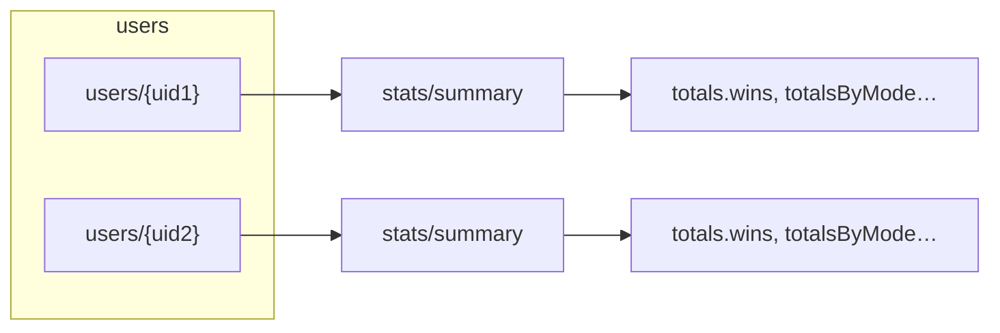

# Leaderboards — query-path schema (Story B1)

**Status:** Implemented (schema + indexes + types)  
**Depends on:** [leaderboards-phase3-adr.md](leaderboards-phase3-adr.md) (Story A0), [gameplay-stats-phase2.md](gameplay-stats-phase2.md)  
**See also (batch path):** [leaderboards-schema-precomputed.md](leaderboards-schema-precomputed.md) (Story B2) — same score semantics; precomputed top-K docs for cheap reads at scale.  
**Indexes & pagination (Story B3):** [leaderboards-indexes-pagination.md](leaderboards-indexes-pagination.md) — composite indexes, `limit` / `startAfter`, deploy.  
**Trusted writes (Story C1):** [leaderboards-trusted-writer-c1.md](leaderboards-trusted-writer-c1.md) — `stats/summary` updates only via Admin SDK + idempotent events.  
**HTTP API (Story D1):** [leaderboards-api-d1.md](leaderboards-api-d1.md) — `GET /api/v1/leaderboards` (collection-group query + pagination).

## Summary

v1 leaderboards rank users by **all-time `wins`** (see ADR). The **query path** reuses the existing Phase 2 aggregate document **`users/{uid}/stats/summary`** as the authoritative per-user row. There is **no separate `leaderboardEntries` collection** for v1: “rows” are **`stats/summary`** documents queried via **collection group** `stats` and ordered by the appropriate **`wins`** field. The server does **not** use `where(documentId == 'summary')` on that collection group (Firestore requires a full path for that filter); v1 assumes **`summary` is the only doc** under each user’s `stats` subcollection.

**Weekly / `weekId`:** Out of scope for v1 (reserved in ADR). No `weekId` field in v1 query path.

## Physical layout



- **Collection group name:** `stats` (subcollection under each `users/{uid}`).
- **Document id:** `summary` (constant `STATS_DOC_ID` / `USER_STATS_DOC_ID`).

## Authoritative document shape (existing)

The full shape is defined in Phase 2 and `server/stats-aggregate.js`. Fields used for leaderboard **score**:

| Board scope | Firestore field used as `score` |
|-------------|-----------------------------------|
| **Global all-time** | `totals.wins` (number) |
| **Per-mode all-time** | `totalsByMode.{gameMode}.wins` for `{gameMode}` ∈ `bio-ball`, `career-path`, `nickname-streak` |

**Example** `users/abc123/stats/summary` (abbreviated):

```json
{
  "aggregateVersion": 1,
  "totals": {
    "gamesPlayed": 42,
    "wins": 30,
    "losses": 10,
    "abandoned": 2
  },
  "totalsByMode": {
    "bio-ball": { "gamesPlayed": 20, "wins": 15, "losses": 4, "abandoned": 1 },
    "career-path": { "gamesPlayed": 12, "wins": 10, "losses": 2, "abandoned": 0 },
    "nickname-streak": { "gamesPlayed": 10, "wins": 5, "losses": 4, "abandoned": 1 }
  },
  "streaks": { "currentWinStreak": 2, "bestWinStreak": 8 },
  "bests": { "fastestWinMs": 12000, "fewestMistakesWin": 0, "byMode": {} },
  "lastPlayedAt": "<Timestamp>",
  "updatedAt": "<Timestamp>",
  "statsUpdatedAt": "<Timestamp>"
}
```

Missing `totals` / `totalsByMode` / nested mode keys should be treated as **0** wins when sorting.

## Virtual “leaderboard row” (API / UI)

Rank is **not** stored in Firestore. The **trusted server** (Express Admin SDK or Cloud Function) runs the collection-group query, applies **tie-break** (`score` desc, then `uid` asc per ADR), assigns **`rank`**, and may attach **`displayName`** from Firebase Auth (not written back to Firestore for v1). See TypeScript **`LeaderboardEntryRow`** in `src/app/shared/models/leaderboard-query.model.ts`.

**PII:** Only **`displayName`** (or display handle) as returned by Auth / product policy — no email in leaderboard payloads by default.

## Queries (server-side only)

**Important:** Security rules allow each user to read **only their own** `stats` documents. **Cross-user** collection-group reads **cannot** run from the browser. Implement leaderboard fetches in **trusted code** (Admin SDK) or serve **precomputed** docs (Story B2) with separate rules.

### Global all-time

- Collection group: `stats`
- Order by: `totals.wins` descending, then `FieldPath.documentId()` ascending (see B3)
- Limit: cap (e.g. 50)

### Per-mode all-time

Same pattern with order by:

- `totalsByMode.bio-ball.wins`
- `totalsByMode.career-path.wins`
- `totalsByMode.nickname-streak.wins`

Each scope needs a **composite index** (document id + sort field). See `firestore.indexes.json`.

## Firestore indexes

Composite **collection group** indexes are listed and explained in **[leaderboards-indexes-pagination.md](leaderboards-indexes-pagination.md)** (Story B3), including the canonical **`orderBy`** chain, **`limit`** caps (`LEADERBOARD_MAX_PAGE_SIZE`), and **`startAfter`** pagination. Source of truth: **`firestore.indexes.json`** (four indexes on `stats`: global + three modes).

Deploy indexes with rules to the **`roster-riddles`** database — see [firestore-rules-deploy.md](firestore-rules-deploy.md) § Composite indexes.

## Security rules impact (read/write matrix)

| Path | Client read | Client write | Admin / trusted |
|------|-------------|--------------|-----------------|
| `users/{uid}/stats/summary` | Own user only (unchanged) | Denied (unchanged) | Full (writes via gameplay pipeline) |
| Collection-group query across all `stats` | **Not allowed** from client | N/A | **Yes** (leaderboard API) |

No rule change is required for Story B1 as long as leaderboard data is served only via **trusted** backends. If you later add **public** denormalized leaderboard documents (Story B2), add explicit `match` rules for those paths.

## References

- `server/stats-aggregate.js` — aggregate shape
- `src/app/shared/models/user-stats.model.ts` — client types for `stats/summary`
- `src/app/shared/models/leaderboard-query.model.ts` — virtual row for API responses + page size caps
- [leaderboards-indexes-pagination.md](leaderboards-indexes-pagination.md) — indexes + pagination (Story B3)
