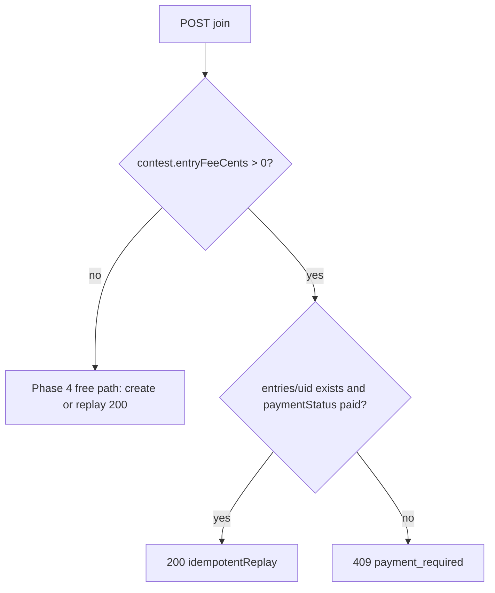

# Weekly contests — join API (Story C1)

**Status:** Implemented (Express)  
**Depends on:** [weekly-contests-schema-contests.md](weekly-contests-schema-contests.md), [weekly-contests-schema-entries.md](weekly-contests-schema-entries.md), [weekly-contests-phase5-entry-fees-adr.md](weekly-contests-phase5-entry-fees-adr.md) (paid vs free join)

## Endpoint

`POST /api/v1/contests/:contestId/join`

**Auth:** `Authorization: Bearer <Firebase ID token>` (same as `GET /api/v1/me`).

**Body (optional JSON):**

```json
{
  "clientRequestId": "opaque-string-for-logging-optional"
}
```

## Success — **200**

```json
{
  "idempotentReplay": false,
  "entry": {
    "schemaVersion": 1,
    "contestId": "…",
    "uid": "…",
    "rulesAcceptedVersion": 1,
    "joinedAt": "2026-04-17T12:00:00.000Z",
    "displayNameSnapshot": "Player",
    "clientRequestId": "…"
  },
  "contest": {
    "contestId": "…",
    "status": "open",
    "gameMode": "bio-ball",
    "rulesVersion": 1,
    "leagueGamesN": 10,
    "windowStart": "…",
    "windowEnd": "…",
    "title": "…"
  }
}
```

If the user already has an entry document, **`idempotentReplay`** is **`true`** and the same shapes are returned (no duplicate write).

### Paid contests (`entryFeeCents > 0`) — Phase 5 Story P5-F1

When **`contests/{contestId}.entryFeeCents`** is a **positive** integer (paid entry fee), this endpoint **does not** create an entry. Clients must use **`POST /api/v1/contests/:contestId/checkout-session`** and complete Stripe Checkout; the **webhook** creates `entries/{uid}` with **`paymentStatus: paid`** ([weekly-contests-api-phase5.md](weekly-contests-api-phase5.md)).

| Situation | HTTP | Response |
|-----------|------|----------|
| No entry yet | **409** | `error.code: payment_required`, `error.entryFeeCents` — use Checkout |
| Entry exists but not **`paid`** (e.g. `failed`, `pending`, legacy row without payment, `refunded`) | **409** | Same **`payment_required`** |
| Entry exists with **`paymentStatus: paid`** | **200** | Normal **`idempotentReplay: true`** (same as free replay) |

**Free contests** (`entryFeeCents === 0` or absent): unchanged — first call creates the entry; repeats return **200** with **`idempotentReplay: true`**. Regression: Story **P5-F2** — [`server/contests/contest-entry-fee.test.js`](../server/contests/contest-entry-fee.test.js); manual **Walk C** in [weekly-contests-ui-walkthrough-check.md](weekly-contests-ui-walkthrough-check.md).



## Errors

| HTTP | `error.code` | When |
|------|----------------|------|
| 400 | `validation_error` | Bad `contestId` or JSON body |
| 400 | `contest_not_open` | Contest `status !== open` |
| 400 | `join_window_closed` | Server time not in `[windowStart, windowEnd)` |
| 400 | `wrong_game_mode` | Contest is not Bio Ball (Phase 4 v1) |
| 401 | `unauthenticated` | Missing/invalid Bearer token |
| 404 | `contest_not_found` | No `contests/{contestId}` document |
| 409 | `payment_required` | Contest has **`entryFeeCents > 0`**. Use Checkout (`POST .../checkout-session`); entry is created on successful payment webhook. Body includes **`error.entryFeeCents`**. (Story P5-F1.) |
| 409 | `already_in_open_contest` | User already has an entry in another **`open`** contest with the same `gameMode` (one open contest per game type at a time). Response may include `existingContestId`. |
| 429 | `rate_limited` | Per-uid join rate cap (see below) |
| 500 | `internal_error` | Firestore/Auth failure |
| 503 | `server_misconfigured` | Admin SDK / Firestore not configured |

## Rate limits (F1-style)

| Env | Default |
|-----|---------|
| `CONTEST_JOIN_RATE_LIMIT_MAX` | **30** / window |
| `CONTEST_JOIN_RATE_LIMIT_WINDOW_MS` | **60000** |

Disable all rate limits (local stress): `RATE_LIMITS_DISABLED=true` (same as leaderboards/gameplay).

## Logging

Structured lines: `component: contest_join`, `outcome`, `requestId`, `httpStatus`, **`contestId`** — **no** email; **uid** is implied by authenticated subject only in your access logs if at all.

## Implementation

| File | Role |
|------|------|
| `server/contests/contest-join.http.js` | Handler |
| `server/contests/contest-join-paid-replay.js` | Paid-contest idempotent replay rule (P5-F1) |
| `server/contests/contest-entry-fee.js` | `getEntryFeeCentsFromContest` (join / checkout / webhooks; P5-F2 tests) |
| `server/contests/contest-join-log.js` | JSON logs |
| `server/middleware/rate-limit-hooks.middleware.js` | `contestJoinRateLimitHookMiddleware` |
| `index.js` | Route registration |

## References

- [weekly-contests-phase4-jira.md](weekly-contests-phase4-jira.md) — Story C1  
- [weekly-contests-api-d2.md](weekly-contests-api-d2.md) — Story D2 (list/detail reads)  
